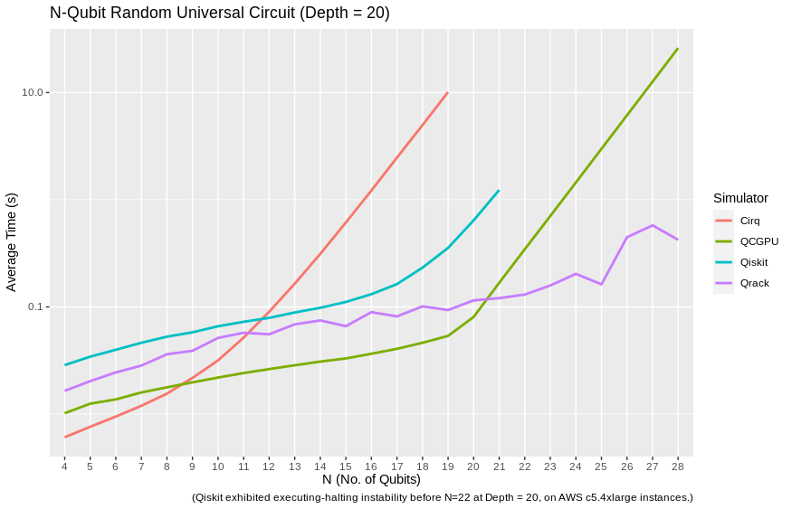

#################
Qrack Performance
#################

Abstract
********

The Qrack quantum simulator is an open-source C++ high performance, general
purpose simulation supporting arbitrary numbers of entangled qubits.  While
there are a variety of other quantum simulators such as [QSharp]_, [QHiPSTER]_,
and others listed on [Quantiki]_, Qrack represents a unique offering suitable
for applications across the field.

A selection of performance tests are identified for creating comparisons
between various quantum simulators.  These metrics are implemented and
analyzed for Qrack.  These experimentally derived results compare favorably
against theoretical boundaries, and out-perform naive implementations for many
scenarios.

Introduction
************

There are a growing number of quantum simulators available for research and
industry use.  Many of them perform quite well for smaller number of qubits,
and are suitable for non-rigorous experimental explorations.  Fewer projects
are suitable as "high performance" candidates in the >32 qubit range. Many 
rely on the common approach often described as the "Schrödinger method," 
doubling RAM usage by a factor of 2 per fully interoperable qubit, or else 
Feynman path integrals, which can become intractible at arbitrary circuit depth.
Attempting to build on the work of IBM's `Breaking the 49-Qubit Barrier in the Simulation of Quantum Circuits` [Pednault2017]_ paper, 
with more recent attention to potential improvements inspired by Gottesman-Knill stabilizer simulators,
Qrack can execute surprisingly general circuits up to 64 qubits in width on modest single nodes,
such as constrained cases of the QFT.

Qrack is an open-source quantum computer simulator option, implemented in C++, 
supporting integration into other popular compilers and interfaces, suitable for utilization in a wide variety
of projects.  As such, it is an ideal test-bed for establishing a set of
benchmarks useful for comparing performance between various quantum
simulators.

Qrack provides a "QEngineCPU" and a "QEngineOCL" that represent non-OpenCL and 
OpenCL base implementations, which could also be the most efficient types to 
use directly in the limit of maximal entanglement. For general use cases, 
the "QUnit" layer provides explicit Schmidt decomposition on top of another 
engine type (per [Pednault2017]_) and "QFusion" provides a "gate fusion" 
layer. A "QEngine" type is always the base layer, and QUnit and QFusion types 
may be layered over these, and over each other.

This version of the Qrack benchmarks contains comparisons against other
publicly available simulators, specifically Cirq, QCGPU, and Qiskit (each with its
default simulator, if multiple were available). Qrack has been incorporated as an optional
back end for ProjectQ and plugin for Qiskit, in repositories maintained by the developers of Qrack, and
benchmarks for their performance will follow.

Reader Guidance
===============

This document is largely targeted towards readers looking for a quantum
simulator that desire to establish the expected bounds for various use-cases
prior to implementation.

Disclaimers
===========

* Your Mileage May Vary - Any performance metrics here are the result of
  experiments executed with selected compilation and execution parameters on a
  system with a degree of variability; execute the supplied benchmarks on the
  desired target system for accurate performance assessments.

* Benchmarking is Hard - While we've attempted to perform clean and accurate
  results, bugs and mistakes do occur.  If flaws in process are identified,
  please let us know!

Method
******

This performance document is meant to be a simple, to-the-point, and preliminary digest of these results. We plan to submit a formal academic report for peer review of these results, in full detail, as soon as we collect sufficient feedback on the preprint. (The originally planned date of submission was in February of 2020, but it seems that COVID-19 has hindered our ability to seek preliminary feedback.) These results were prepared with the generous financial support of the Unitary Fund. However, we offer that our benchmark code is public, largely self-explanatory, and easily reproducible, while we prepare that report. Hence, we release these partial preliminary results now.

100 timed trials of single and parallel gates were run for each qubit count between 4 and 28 qubits. Three tests were performed: the quantum Fourier transform, ("QFT"), random circuits constructed from a universal gate set, and an idealized approximation of Google's Sycamore chip benchmark, as per [Sycamore]_. The benchmarking code is available at `https://github.com/vm6502q/simulator-benchmarks <https://github.com/vm6502q/simulator-benchmarks>`_.

CPU and GPU benchmarks were run on two respective systems that could represent realistic use cases for each engine type. Among AWS virtual machine instances, we sought to find those systems with the lowest possible cost to run the benchmarks for their respective execution times, at or below for the 28 qubit mark. An AWS g3s.xlarge running Ubuntu Server 18.04LTS was selected for GPU benchmarks. An AWS c5.4xlarge running Ubuntu Server 18.04LTS was selected for CPU benchmarks, including FFTW3 for comparison on the QFT test. Benchmarks were collected from December 27, 2019 through January 24, 2020. Given delays in soliciting peer opinion, while development of Qrack continued, the Qrack benchmarks were updated on April 5, 2020. These results were combined with single gate, N-width gate and Grover's search benchmarks for Qrack, collected overnight from December 19th, 2018 into the morning of December 20th. (The potential difference since December 2018 in these particular Qrack tests reused from then should be insignificant. We took care to try to report fair tests, within cost limitations, but please let us know if you find anything that appears misrepresentative.)

The average time of each set of 100 was recorded and graphed. Grover's search to invert a black box subroutine, or "oracle," was similarly implemented for trials between 5 and 20 qubits, for QEngineOCL with and without QUnit and QFusion layers. Grover's algorithm was iterated an optimal number of times, vs. qubit count, to maximize probability on a half cycle of the algorithm's period, being :math:`floor\left[\frac{\pi}{4asin^2\left(1/\sqrt{2^N}\right)}\right]` iterations for :math:`N` qubits.

Comparative benchmarks included Cirq, QCGPU, and Qiskit, and Qrack's "QUnit" layer on top of "QFusion" and "QEngineOCL." (Default simulators were used, for other candidates, if more than one option was available.) QFT benchmarks could be implemented in a straightforward manner on all simulators, and were run as such. Qrack appears to be the only candidate considered for which inputs into the QFT can (drastically) affect its execution time, with permutation basis states being run in much shorter time, for example, hence only Qrack required a more general random input, whereas all other simulators including FFTW3 were started in the |0> state. For a sufficiently representatively general test, Qrack instead used registers of single separable qubits intialized with uniformly randomly distributed probability between |0> and |1>, and uniformly randomly distributed phase offset between those states. FFTW3 was included in this test, in "in-place" mode on complex single floats, since all other DFT tests are effectively "in-place" method, here.

Random universal circuits carried out layers of single qubit gates on every qubit in the width of the test, followed by layers randomly selected couplings of (2-qubit) CNOT, CZ, and SWAP, or (3-qubit) CCNOT, eliminating each selected bit for the layer. 20 layers of 1-qubit-plus-multi-qubit iterations were carried out, for each qubit width, for the benchmarks presented here.

For the Sycamore circuit idealization, the quoted 2-qubit "typical" gate of "iSWAP" with "1/6th CZ" was used in all cases. Sycamore circuits were carried out similarly to random universal circuits and the method of the [Sycamore]_ paper, interleaving 1-qubit followed by 2-qubit layers, to depth of 20 layers each. Whereas as that original source appears to have randomly fixed its target circuit ahead of any trials, and then carried the same pre-selected circuit out repeatedly for the required number of trials, all benchmarks in the case of this report generated their circuits per-iteration on-the-fly, per the selection criteria as read from the text of [Sycamore]_. With the 2-qubit gate idealization already mentioned, Qrack easily implemented the original Sycamore circuit exactly. By nature of the simulation methods used in each other candidate, atomic "convenience method" 1-qubit and 2-qubit gate definitions could potentially easily be added to every every candidate for this test, hence we thought it most representative to make largely performance-irrelevant substitutions of 1-qubit and 2-qubit gates for those candidates which did not already define sufficient API convenience methods, without nonrepresentatively complicated gate decompositions. We strongly encourage the reader to inspect and independently execute the simple benchmarking code which was already linked in the beginning of this "Method" section, for total specific detail.

Qrack QEngine type heap usage was established as very closely matching theoretical expections, in earlier benchmarks, and this has not fundamentally changed. QUnit type heap usage varies greatly dependent on use case, though not in significant excess of QEngine types. No representative RAM benchmarks have been established for QUnit types, yet. QEngine Heap profiling was carried out with Valgrind Massif. Heap sampling was limited but ultimately sufficient to show statistical confidence.

Results
*******

We observed extremely close correspondence with Schrödinger method theoretical complexity and RAM usage considerations for the behavior of QEngine types. QEngineCPU and QEngineOCL require exponential time for a single gate on a coherent unit of N qubits. QUnit types with explicitly separated subsystems as per [Pednault2017]_ show constant time requirements for the same single gate.

.. image:: performance/x_single.png

.. image:: performance/cnot_single.png

QEngineCPU and QEngineOCL can perform many identical gates in parallel across entangled subsystems for an approximately constant costs, when total qubits in the engine are held fixed as breadth of the parallel gate application is varied. To test this, we can apply parallel gates at once across the full width of a coherent array of qubits. (CNOT is a two bit gate, so :math:`(N-1)/2` gates are applied to odd numbers of qubits.) Notice in these next graphs how QEngineCPU and QEngineOCL have similar scaling cost as the single gate graphs above, while QUnit types show a linear trend (appearing logarithmic on an exponential axis scale):

.. image:: performance/x_all.png

.. image:: performance/cnot_all.png

Heap sampling supports theoretical expecations to high confidence. Complex numbers are represented as 2 single (32-bit) or 2 double (64-bit) accuracy floating point types, for real and imaginary components. The use of double or single precision is controlled by a compilation flag. There is one complex number per permutation in a separable subsystem of qubits. QUnit explicitly separates subsystems, while QEngine maintains complex amplitudes for all :math:`2^N` permutations of :math:`N` qubits. QEngines duplicate their state vectors once during many gates, like arithmetic gates, for speed and simplicity where it eases implementation.

.. image:: performance/qrack_ram.png

QUnit explicitly separates its representation of the quantum state and may operate with much less RAM, but QEngine's RAM usage represents approximately the worst case for QUnit, of maximal entanglement. OpenCL engine types attempt to use memory on the accelerator device instead of general heap when a QEngineOCL instance can fit a single copy of its state vector in a single allocation on the device. On many modern devices, state vectors up to about 1GB in size can be allocated directly on the accelerator device instead of using general heap. A auxiliary buffer used for normalization is half the size of the state vector, and this buffer is always allocated in general heap.

Grover's algorithm is a relatively ideal test case, in that it allows a modicum of abstraction in implementation while representing an ostensibly practical and common task for truly quantum computational hardware. For 1 expected correct function inversion result, there is a well-defined highest likelihood search iteration count on half a period of the algorithm for a given number of oracle input permutations to search. Time required to run the test for QEngineCPU up to 20 qubits became prohibitive, hence we leave its variants off the graph. However, we can establish baseline for OpenCL performance, with Grover's search, and compare the performance of a "QEngine-method" to a "QUnit-method." This graphs shows average time against qubit count for an optimal half period search:

.. image:: performance/grovers.png

[Broda2016]_ discusses how Grover's might be adapted in practicality to actually "search an unstructured database," or search an unstructured lookup table, and Qrack is also capable of applying Grover's search to a lookup table with its IndexedLDA, IndexedADC, and IndexedSBC methods. Benchmarks are not given for this arguably more practical application of the algorithm, because few other quantum computer simulator libraries implement it, yet.

The "quantum" (or "discrete") Fourier transform (QFT/DFT) is a realistic and important test case for its direct application in day-to-day industrial computing applications, as well as for being a common processing step in many quantum algorithms.

.. image:: performance/qft.png

.. image:: performance/qft_optimization.png

Recall that QCGPU and Qrack are GPU-implementations run on AWS g3s.xlarge instances, whereas all other candidates are run on AWS c5.4xlarge instances. Under these considerations, by the 28 qubit level, Qrack out-performs all other candidates except FFTW3. (Recall, also, that Qrack uses a representatively "hard" initialization on this test, as described above, whereas permutation basis eigenstate inputs, for example, are much more quickly executed.) Though we are comparing CPU to GPU, CPU-based FFTW3 is clearly the best suited for low numbers of qubits, in general. However, Qrack is the only candidate tested which exhibits even better special case performance on the QFT, as for random permutation basis eigenstate initialization, or initialization via permutation basis eigenstates with random "H" gates applied, before QFT.

Similarly, on random universal circuits, defined above and in the benchmark repository, Qrack leads over all other candidates considered by the 21 qubit mark and up. GPU-based QCGPU leads on the test system for 20 qubits and below, and CPU-based Cirq leads for 8 qubits and fewer.

Qrack's QUnit makes a fundamental improvement on an idealization of the Sycamore circuit, which we strongly encourage the reader to analyze and reproduce with the provided public benchmark code.

.. image:: performance/sycamore.png

Discussion
**********

Up to a consistent deviation at low qubit counts, speed and RAM usage for Schrödinger method "QEngine" types is well predicted by theoretical complexity considerations of the gates, up to about a factor of 2 on heap usage for duplication of the state vector, with additional 1/2 the size of state vector allocated by QEngineOCL for an auxiliary normalization buffer.

Qrack::QUnit succeeds as a novel and fundamentally improved quantum simulation algorithm, over the naive Schrödinger algorithm. Primarily, QUnit does this by representing its state vector in terms of decomposed subsystems, as well as buffering and commuting H gates and singly-controlled gates. On user and internal probability checks, QUnit will attempt to separate the representations of independent subsystems by Schmidt decomposition. Further, Qrack will avoid applying phase effects that make no difference to the expectation values of any Hermitian operators, (no difference to "physical observables"). For each bit whose representation is separated this way, we recover a factor of close to or exactly 1/2 the subsystem RAM and gate execution time.

Further Work
************

A formal report of the above and additional benchmark results, in much greater detail and specificity, is planned to be submitted for publication as soon as sufficient preliminary peer opinion can be collected on the preprint, in early to mid 2020, thanks to the generous support of the Unitary Fund.

Qrack previously contained two experimental multiprocessor types, "QEngineOCLMulti" based on the algorithms developed in Intel's [QHiPSTER]_, and the simpler QUnitMulti type, which dispatches different separable subsystems to different processors. These failed to outperform the single processor QEngineOCL. However, as Qrack has added optional support as a simulator for ProjectQ, we have effectively gained access to the quantum network simulator "SimulaQron" by SoftwareQuTech. At least one Qrack user is experimenting with scaling deployments of containers loaded with Qrack, ProjectQ, and SimulaQron as an effective solution for multiprocessor and cluster operations, and the Qrack team is looking at this and related approaches for this purpose. An asynchronous quantum P2P model, for effective multiprocessor support, should hopefully reduce inter-device communication overhead bottlenecks.

With the new generation of "VPU" processors available in 2019 and 2020, (for visual inference,) it might be possible to co-opt VPU capabilities for inference of raw state vector features, such as Schmidt separability, to improve the performance of QUnit. The authors of Qrack have started looking at this hardware for this purpose.

We will maintain systematic comparisons to published benchmarks of quantum computer simulation standard libraries, as they arise.

Conclusion
**********

Per [Pednault2017]_, and many other attendant and synergistic optimizations engineered specifically in Qrack's QUnit, explicitly separated subsystems of qubits in QUnit have a significant RAM and speed edge in many cases over the Schrödinger algorithm of most popular quantum computer simulators. Qrack gives very efficient performance on a single node past 32 qubits, up to the limit of maximal entanglement.

Citations
*********

.. target-notes::

.. [Broda2016] `Broda, Bogusław. "Quantum search of a real unstructured database." The European Physical Journal Plus 131.2 (2016): 38. <https://arxiv.org/abs/1502.04943>`_
.. [Pednault2017] `Pednault, Edwin, et al. "Breaking the 49-qubit barrier in the simulation of quantum circuits." arXiv preprint arXiv:1710.05867 (2017). <https://arxiv.org/abs/1710.05867>`_
.. [QSharp] `Q# <https://www.microsoft.com/en-us/quantum/development-kit>`_
.. [QHiPSTER] `QHipster <https://github.com/intel/Intel-QS>`_
.. [Quantiki] `Quantiki: List of QC simulators <https://www.quantiki.org/wiki/list-qc-simulators>`_
.. [Sycamore] `Arute, Frank, et al. "Quantum supremacy using a programmable superconducting processor" <https://www.nature.com/articles/s41586-019-1666-5>`_
