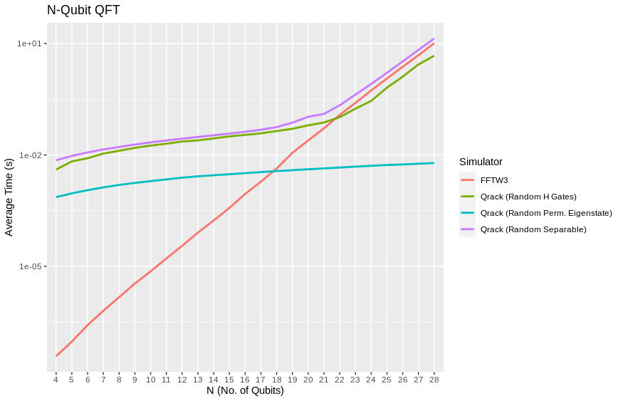
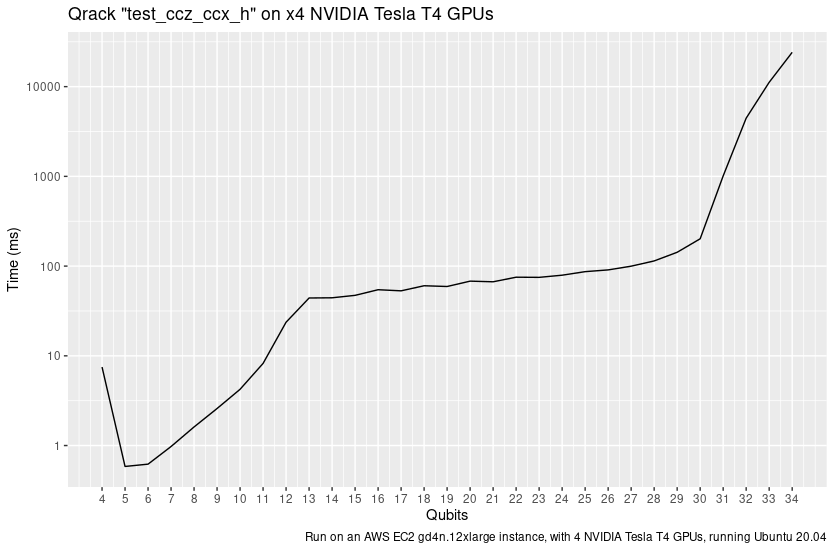

#################
Qrack Performance
#################

Abstract
********

The Qrack quantum simulator is an open-source C++ high performance, general
purpose simulation supporting arbitrary numbers of entangled qubits.  While
there are a variety of other quantum simulators such as [QSharp]_, [QHiPSTER]_,
and others listed on [Quantiki]_, Qrack represents a unique offering suitable
for applications across the field.

A selection of performance tests are identified for creating comparisons
between various quantum simulators.  These metrics are implemented and
analyzed for Qrack.  These experimentally derived results compare favorably
against theoretical boundaries, and out-perform naive implementations for many
scenarios.

Introduction
************

There are a growing number of quantum simulators available for research and
industry use.  Many of them perform quite well for smaller number of qubits,
and are suitable for non-rigorous experimental explorations.  Fewer projects
are suitable as "high performance" candidates in the >32 qubit range. Many 
rely on the common approach often described as the "Schrödinger method," 
doubling RAM usage by a factor of 2 per fully interoperable qubit, or else 
Feynman path integrals, which can become intractible at arbitrary circuit depth.
Attempting to build on the work of IBM's `Breaking the 49-Qubit Barrier in the Simulation of Quantum Circuits` [Pednault2017]_ paper, 
with more recent attention to potential improvements inspired by Gottesman-Knill stabilizer simulators,
Qrack can execute surprisingly general circuits past 32 qubits in width on modest single nodes.

Qrack is an open-source quantum computer simulator option, implemented in C++, 
supporting integration into other popular compilers and interfaces, suitable for utilization in a wide variety
of projects.  As such, it is an ideal test-bed for establishing a set of
benchmarks useful for comparing performance between various quantum
simulators.

Qrack provides a "QEngineCPU" and a "QEngineOCL" that represent non-OpenCL and 
OpenCL base implementations for Schrödinger method simulation. "QHybrid" switches off between
these two types internally for best performance at low qubit widths. "QStabilizerHybrid" switches
off internally between Gottesman-Knill "stabilizer" simulation and Schrödinger method. For general use cases,
the "QUnit" layer provides explicit Schmidt decomposition on top of another 
engine type (per [Pednault2017]_). "QPager" segments a Schrödinger method simulation
into equally sized "pages" that can be run on multiple OpenCL devices or multiple maximum
allocation segments of a single device, increasing greatest maximally entangled width.
A "QEngine" type is always the base layer, and QUnit, QStabilizerHybrid, and QPager types
may be layered over these, and over each other.

This version of the Qrack benchmarks contains comparisons against other
publicly available simulators, specifically QCGPU, and Qiskit (each with its
default simulator, if multiple were available). Qrack has been incorporated as an optional
back end for ProjectQ and plugin for Qiskit, in repositories maintained by the developers of Qrack, and
benchmarks for their performance will follow.

Reader Guidance
===============

This document is largely targeted towards readers looking for a quantum
simulator that desire to establish the expected bounds for various use-cases
prior to implementation.

Disclaimers
===========

* Your Mileage May Vary - Any performance metrics here are the result of
  experiments executed with selected compilation and execution parameters on a
  system with a degree of variability; execute the supplied benchmarks on the
  desired target system for accurate performance assessments.

* Benchmarking is Hard - While we've attempted to perform clean and accurate
  results, bugs and mistakes do occur.  If flaws in process are identified,
  please let us know!

Method
******

This performance document is meant to be a simple, to-the-point, and preliminary digest of these results. We plan to submit a formal academic report for peer review of these results, in full detail, as soon as we collect sufficient feedback on the preprint. (The originally planned date of submission was in February of 2020, but it seems that COVID-19 has hindered our ability to seek preliminary feedback.) These results were prepared with the generous financial support of the Unitary Fund. However, we offer that our benchmark code is public, largely self-explanatory, and easily reproducible, while we prepare that report. Hence, we release these partial preliminary results now.

100 timed trials of single and parallel gates were run for each qubit count between 4 and 28 qubits. Three tests were performed: the quantum Fourier transform, ("QFT"), random circuits constructed from a universal gate set, and an idealized approximation of Google's Sycamore chip benchmark, as per [Sycamore]_. The benchmarking code is available at `https://github.com/vm6502q/simulator-benchmarks <https://github.com/vm6502q/simulator-benchmarks>`_. Default build and runtime options were used for all candidates. **Notably, this means Qrack ran at single floating point accuracy whereas QCGPU and Qiskit ran at double floating point accuracy.**

Among AWS virtual machine instances, we sought to find those systems with the lowest possible cost to run the benchmarks for their respective execution times, at or below for the 28 qubit mark. An AWS g4dn.2xlarge running Ubuntu Server 20.04LTS was selected for GPU benchmarks. Benchmarks were collected from March 4, 2021 through March 7, 2021. These results were combined with single gate, N-width gate benchmarks for Qrack, collected overnight from December 19th, 2018 into the morning of December 20th. (The potential difference since December 2018 in these particular Qrack tests reused from then should be insignificant. We took care to try to report fair tests, within cost limitations, but please let us know if you find anything that appears misrepresentative.)

Comparative benchmarks included QCGPU, the Qiskit-Aer GPU simulator, and Qrack's default typically optimal "stack" of a "QUnit" layer on top of "QStabilizerHybrid," on top of "QPager," on top "QHybrid." All of these candidates are GPU-based. CPU-based Cirq was considered for presentation here, but a nonexhaustive experiment on AWS CPU instances advertised as low cost-for-performance failed to return Cirq results on rough order of cost-for-performance of any GPU candidate. However, the author does not feel comfortable concluding on this basis that CPU-based simulation cost could not be made competitve with GPU-based simulation, hence we omit Cirq from our graphs to avoid potential misrepresentation.

QFT benchmarks could be implemented in a straightforward manner on all simulators, and were run as such. Qrack appears to be the only candidate considered for which inputs into the QFT can (drastically) affect its execution time, with permutation basis states being run in much shorter time, for example, hence only Qrack required a more general random input, whereas all other simulators were started in the |0> state. For a sufficiently representatively general test, Qrack instead used registers of single separable qubits intialized with uniformly randomly distributed probability between |0> and |1>, and uniformly randomly distributed phase offset between those states.

Random universal circuits carried out layers of single qubit gates on every qubit in the width of the test, followed by layers randomly selected couplings of (2-qubit) CNOT, CZ, and SWAP, or (3-qubit) CCNOT, eliminating each selected bit for the layer. 20 layers of 1-qubit-plus-multi-qubit iterations were carried out, for each qubit width, for the benchmarks presented here.

Sycamore circuits were carried out similarly to random universal circuits and the method of the [Sycamore]_ paper, interleaving 1-qubit followed by 2-qubit layers, to depth of 20 layers each. Whereas as that original source appears to have randomly fixed its target circuit ahead of any trials, and then carried the same pre-selected circuit out repeatedly for the required number of trials, all benchmarks in the case of this report generated their circuits per-iteration on-the-fly, per the selection criteria as read from the text of [Sycamore]_. Qrack easily implemented the original Sycamore circuit exactly. By nature of the Schrödinger method simulation used in each other candidate, atomic "convenience method" 1-qubit and 2-qubit gate definitions could potentially easily be added to other candidates for this test, hence **we thought it most representative to make largely performance-irrelevant substitutions of "SWAP" for "iSWAP" for those candidates which did not already define sufficient API convenience methods for "Sycamore" circuits,** without nonrepresentatively complicated gate decompositions. We strongly encourage the reader to inspect and independently execute the simple benchmarking code which was already linked in the beginning of this "Method" section, for total specific detail.

Qrack QEngine type heap usage was established as very closely matching theoretical expections, in earlier benchmarks, and this has not fundamentally changed. QUnit type heap usage varies greatly dependent on use case, though not in significant excess of QEngine types. No representative RAM benchmarks have been established for QUnit types, yet. QEngine Heap profiling was carried out with Valgrind Massif. Heap sampling was limited but ultimately sufficient to show statistical confidence.

Results
*******

We observed extremely close correspondence with Schrödinger method theoretical complexity and RAM usage considerations for the behavior of QEngine types. QEngineCPU and QEngineOCL require exponential time for a single gate on a coherent unit of N qubits. QUnit types with explicitly separated subsystems as per [Pednault2017]_ show constant time requirements for the same single gate.

.. image:: performance/x_single.png

.. image:: performance/cnot_single.png

QEngineCPU and QEngineOCL can perform many identical gates in parallel across entangled subsystems for an approximately constant costs, when total qubits in the engine are held fixed as breadth of the parallel gate application is varied. To test this, we can apply parallel gates at once across the full width of a coherent array of qubits. (CNOT is a two bit gate, so :math:`(N-1)/2` gates are applied to odd numbers of qubits.) Notice in these next graphs how QEngineCPU and QEngineOCL have similar scaling cost as the single gate graphs above, while QUnit types show a linear trend (appearing logarithmic on an exponential axis scale):

.. image:: performance/x_all.png

.. image:: performance/cnot_all.png

Heap sampling supports theoretical expecations to high confidence. Complex numbers are represented as 2 single (32-bit) or 2 double (64-bit) accuracy floating point types, for real and imaginary components. The use of double or single precision is controlled by a compilation flag. There is one complex number per permutation in a separable subsystem of qubits. QUnit explicitly separates subsystems, while QEngine maintains complex amplitudes for all :math:`2^N` permutations of :math:`N` qubits. QEngines duplicate their state vectors once during many gates, like arithmetic gates, for speed and simplicity where it eases implementation.

.. image:: performance/qrack_ram.png

QUnit explicitly separates its representation of the quantum state and may operate with much less RAM, but QEngine's RAM usage represents approximately the worst case for QUnit, of maximal entanglement. OpenCL engine types attempt to use memory on the accelerator device instead of general heap when a QEngineOCL instance can fit a single copy of its state vector in a single allocation on the device. On many modern devices, state vectors up to about 1GB in size can be allocated directly on the accelerator device instead of using general heap. "Paging" with QPager allows multiple such maximum allocation segments to be used for the same single simulation. If the normalization option is on, an auxiliary buffer is allocated for normalization that is half the size of the state vector.

The "quantum" (or "discrete") Fourier transform (QFT/DFT) is a realistic and important test case for its direct application in day-to-day industrial computing applications, as well as for being a common processing step in many quantum algorithms.

.. image:: performance/qft.png

By the 28 qubit level, and at very low qubit widths, Qrack out-performs QCGPU and Qiskit. (Recall that Qrack uses a representatively "hard" initialization on this test, as described above, whereas permutation basis eigenstate inputs, for example, are much more quickly executed.) Qrack is the only candidate tested which exhibits special case performance on the QFT, as for random permutation basis eigenstate initialization, or initialization via permutation basis eigenstates with random "H" gates applied, before QFT.

Similarly, on random universal circuits, defined above and in the benchmark repository, Qrack leads over all other candidates at the high qubit width end.

.. image:: performance/random_universal.png

For "Sycamore" circuits, argued by other authors to establish "quantum supremacy" of native quantum hardware, all simulators tested maintain their general performance trends, as above.

.. image:: performance/sycamore.png

To test new capabilities of the "QPager" layer, a slightly different random universal circuit provided in the Qrack benchmark suite was run on a g4dn.12xlarge with 4 NVIDIA Tesla T4 GPUs, to the maximum qubit width possible, which was 34 qubits. The random gate set selected from is {CCZ, CCNOT, CZ, CNOT} and {H, X, Z} for multi- and single qubit gates.

With the recently improved QPager layer, it is often possible to achieve a 2 qubit greater maximum width on the same GPU hardware as a result of using all 4 maximum allocation segments typical of NVIDIA GPUs. QPager combines "pages" of maximum allocation segment on an OpenCL device, which are typically of a much smaller size than the overall RAM of the GPU. Proceeding to higher factors of 2 times page count, it becomes possible to use general RAM heap without exceeding maximum allocation according to the OpenCL standard, as is demonstrated in the graph above. The threshold to cross from single GPU into multi-GPU is 31 qubits, using 2 GPUs at that level, and the threshold for general heap usage is likely crossed at 33 qubits, using the maximum VRAM of 4 NVIDIA T4 GPUs at 32 qubits.

Discussion
**********

Qrack::QUnit succeeds as a novel and fundamentally improved quantum simulation algorithm, over the naive Schrödinger algorithm in special cases. Primarily, QUnit does this by representing its state vector in terms of decomposed subsystems, as well as buffering and commuting Pauli X and Y basis transformations and singly-controlled gates. On user and internal probability checks, QUnit will attempt to separate the representations of independent subsystems by Schmidt decomposition. Further, Qrack will avoid applying phase effects that make no difference to the expectation values of any Hermitian operators, (no difference to "physical observables"). For each bit whose representation is separated this way, we recover a factor of close to or exactly 1/2 the subsystem RAM and gate execution time.

Qrack::QPager, recently, gives several major advantages with or without a Qrack::QUnit layer on top. It usually allows 2 greater maximum qubit width allocation on the same 4-segment GPU RAM store, and it performs surprisingly well for execution speed at high qubit widths. It can also utilize larger system general RAM heap stores than what is available just as GPU RAM.

Qrack has seemingly poor mid-range qubit width performance on the selected g4dn.2xlarge instance, (or, alternatively, good performance at very narrow and very wide ends of the scale, which is not maintained in middle range). As the g4dn.2xlarge only provides 8 "vCPU" units, which is far smaller than a typical PC CPU, mid-range performance might be alleviated somewhat by a more powerful CPU alongside GPU resources. Further, the use of the QPager layer under QUnit might incur a performance penalty at widths too wide for QHybrid optimization with CPU simulation, but too narrow to see returns from the complexity of QPager. While it might be disappointing that the default "layer stack" for Qrack does not perform best across all qubit widths on the selected AWS EC2 instance, good performance at the very wide and very narrow ends of the scale likely still motivates the adoption of Qrack for HPC and PC simulation.

Further Work
************

A formal report of the above and additional benchmark results, in much greater detail and specificity, is planned to be submitted for publication as soon as sufficient preliminary peer opinion can be collected on the preprint, in early to mid 2021, thanks to the generous support of the Unitary Fund.

We will maintain systematic comparisons to published benchmarks of quantum computer simulation standard libraries, as they arise.

Conclusion
**********

Per [Pednault2017]_, and many other attendant and synergistic optimizations engineered specifically in Qrack's QUnit, explicitly separated subsystems of qubits in QUnit have a significant RAM and speed edge in many cases over the Schrödinger algorithm of most popular quantum computer simulators. With QPager, it is possible to achieve even higher qubit widths and execution speeds. Qrack gives very efficient performance on a single node past 32 qubits, up to the limit of maximal entanglement.

Citations
*********

.. target-notes::

.. [Broda2016] `Broda, Bogusław. "Quantum search of a real unstructured database." The European Physical Journal Plus 131.2 (2016): 38. <https://arxiv.org/abs/1502.04943>`_
.. [Pednault2017] `Pednault, Edwin, et al. "Breaking the 49-qubit barrier in the simulation of quantum circuits." arXiv preprint arXiv:1710.05867 (2017). <https://arxiv.org/abs/1710.05867>`_
.. [QSharp] `Q# <https://www.microsoft.com/en-us/quantum/development-kit>`_
.. [QHiPSTER] `QHipster <https://github.com/intel/Intel-QS>`_
.. [Quantiki] `Quantiki: List of QC simulators <https://www.quantiki.org/wiki/list-qc-simulators>`_
.. [Sycamore] `Arute, Frank, et al. "Quantum supremacy using a programmable superconducting processor" <https://www.nature.com/articles/s41586-019-1666-5>`_
