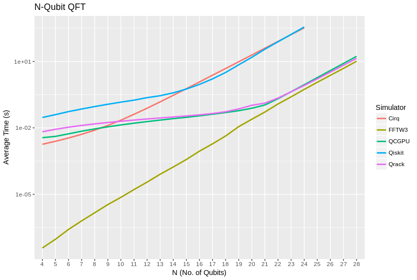
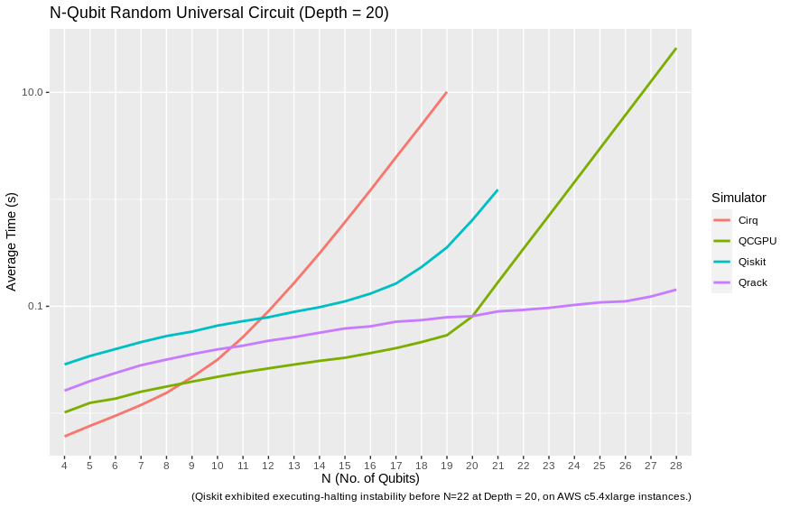
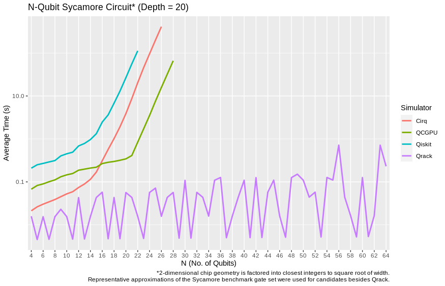

#################
Qrack Performance
#################

Abstract
********

The Qrack quantum simulator is an open-source C++ high performance, general purpose simulation supporting arbitrary numbers of entangled qubits. While there are a variety of other quantum simulators such as [QSharp]_, [QHiPSTER]_, and others listed on [Quantiki]_, Qrack represents a unique offering suitable for applications across the field.

A selection of performance tests are identified for creating comparisons between various quantum simulators. These metrics are implemented and analyzed for Qrack, QCGPU, and Qiskit Aer GPU. Qrack's experimentally derived results compare favorably against theoretical boundaries, and out-perform naive implementations for many scenarios.

Introduction
************

There are a growing number of quantum simulators available for research and industry use. Many of them perform quite well for smaller number of qubits, and are suitable for non-rigorous experimental explorations. Fewer projects are suitable as "high performance" candidates in the >32 qubit range. Many rely on the common approach often described as the "Schrödinger method,"  doubling RAM usage by a factor of 2 per fully interoperable qubit, or else Feynman path integrals, which can become intractible at arbitrary circuit depth. Inspired by IBM's `Pareto-Efficient Quantum Circuit Simulation Using Tensor Contraction Deferral` [Pednault2017]_ paper, instead with a Dirac "ket" centered approach to Schmidt decomposition, and with more recent attention to potential improvements inspired by Gottesman-Knill stabilizer simulators, Qrack can execute surprisingly general circuits past 32 qubits in width on modest single nodes.

Qrack is an open-source quantum computer simulator option, implemented in C++, directly wrapped for Python via "PyQrack," supporting integration into other popular compilers and interfaces, suitable for utilization in a wide variety of projects. As such, it is an ideal test-bed for establishing a set of benchmarks useful for comparing performance between various quantum simulators.

Qrack provides a "QEngineCPU" and a "QEngineOCL" that represent non-OpenCL and OpenCL base implementations for Schrödinger method simulation. "QHybrid" switches off between these two types internally for best performance at low qubit widths. "QStabilizerHybrid" switches off internally between Gottesman-Knill "stabilizer" simulation and Schrödinger method. For general use cases, the "QUnit" layer provides explicit Schmidt decomposition on top of another engine type (per [Pednault2017]_). "QPager" segments a Schrödinger method simulation into equally sized "pages" that can be run on multiple OpenCL devices or multiple maximum allocation segments of a single device, increasing greatest maximally entangled width. A "QEngine" type is always the base layer, and QUnit, QStabilizerHybrid, and QPager types may be layered over these, and over each other.

This version of the Qrack benchmarks contains comparisons against other publicly available simulators, specifically QCGPU, and Qiskit Aer GPU (each with its default simulator, if multiple were available). Qrack has been incorporated as an optional back end for ProjectQ and plugin for Qiskit, in repositories maintained by the developers of Qrack, and benchmarks for their performance will follow.

Reader Guidance
===============

This document is largely targeted towards readers looking for a quantum simulator that desire to establish the expected bounds for various use-cases prior to implementation.

Disclaimers
===========

* Your Mileage May Vary - Any performance metrics here are the result of experiments executed with selected compilation and execution parameters on a system with a degree of variability; execute the supplied benchmarks on the desired target system for accurate performance assessments.

* Benchmarking is Hard - While we've attempted to perform clean and accurate results, bugs and mistakes do occur.  If flaws in process are identified, please let us know!

Method
******

This performance document is meant to be a simple, to-the-point, and preliminary digest of these results. These results were prepared with the generous financial support of the Unitary Fund. Our benchmark code is public, largely self-explanatory, and easily reproducible.

100 timed trials of single and parallel gates were run for each qubit count between 4 and 28 qubits. Three tests were performed: the quantum Fourier transform, ("QFT"), random circuits constructed from a universal gate set, and an idealized approximation of Google's Sycamore chip benchmark, as per [Sycamore]_. The benchmarking code is available at `https://github.com/vm6502q/simulator-benchmarks <https://github.com/vm6502q/simulator-benchmarks>`_. Default build and runtime options were used for all candidates. **Notably, this means Qrack ran at single floating point accuracy whereas QCGPU and Qiskit ran at double floating point accuracy.**

The same Alienware 17 laptop device was used for all benchmarks, (BIOS version 1.8.0, Intel(R) Core(TM) i9-10980HK CPU @ 2.40GHz, NVIDIA GeForce RTX 2070 Super). Benchmarks were collected from the week of October 3, 2021 through October 10, 2021.

Comparative benchmarks included QCGPU, the Qiskit-Aer GPU simulator, and Qrack's default typically optimal "stack" of a "QUnit" layer on top of "QStabilizerHybrid," on top of "QPager," on top of a new Pauli gate fusion layer, on top of "QHybrid." All of these candidates are GPU-based, though Qrack "hybridizes" with CPU based simulation as appropriate to improve performance.

QFT benchmarks could be implemented in a straightforward manner on all simulators, and were run as such. Qrack appears to be the only candidate considered for which inputs into the QFT can (drastically) affect its execution time, with permutation basis states being run in much shorter time, for example, hence only Qrack required a more general random input, whereas all other simulators were started in the |0> state. For a sufficiently representatively general test, Qrack instead used registers of single separable qubits intialized with uniformly randomly distributed probability between |0> and |1>, and uniformly randomly distributed phase offset between those states. Random permutation basis eigenstate initialization is also presented for Qrack, to demonstrate the quantitative difference, though we do not think this a representative test in itself.

Random universal circuits carried out layers of single qubit gates on every qubit in the width of the test, followed by layers randomly selected couplings of (2-qubit) SWAP, CZ, CNOT, or (3-qubit) CCNOT, eliminating each selected bit for the layer. 20 layers of 1-qubit-plus-multi-qubit iterations were carried out, for each qubit width, for the benchmarks presented here.

Sycamore circuits were carried out similarly to random universal circuits and the method of the [Sycamore]_ paper, interleaving 1-qubit followed by 2-qubit layers, to depth of 20 layers each. Whereas as that original source appears to have randomly fixed its target circuit ahead of any trials, and then carried the same pre-selected circuit out repeatedly for the required number of trials, all benchmarks in the case of this report generated their circuits per-iteration on-the-fly, per the selection criteria as read from the text of [Sycamore]_. Qrack easily implemented the original Sycamore circuit exactly. By nature of the Schrödinger method simulation used in each other candidate, atomic "convenience method" 1-qubit and 2-qubit gate definitions could potentially easily be added to other candidates for this test, hence **we thought it most representative to make largely performance-irrelevant substitutions of "SWAP" for "iSWAP" for those candidates which did not already define sufficient API convenience methods for "Sycamore" circuits,** without nonrepresentatively complicated gate decompositions. (Specifically, this is only QCGPU.) We strongly encourage the reader to inspect and independently execute the simple benchmarking code which was already linked in the beginning of this "Method" section, for total specific detail.

Qrack QEngine type heap usage was established as very closely matching theoretical expections, in earlier benchmarks, and this has not fundamentally changed. QUnit type heap usage varies greatly dependent on use case, though not in significant excess of QEngine types. No representative RAM benchmarks have been established for QUnit types, yet.

Results
*******

The "quantum" (or "discrete") Fourier transform (QFT/DFT) is a realistic and important test case for its direct application in day-to-day industrial computing applications, as well as for being a common processing step in many quantum algorithms.

Likely due to a combination of all of its optimization "layers" and techniques, including Schmidt decomposition, "hybridization" of CPU with GPU simulation, and "hybridization" of stabilizer methods with "Schrödinger method," Qrack clearly outperforms purely GPU based simulations at low qubit widths. Recall that Qrack uses a representatively "hard" initialization with uniformly random single qubit unitary gates on this test as described above. We can on the faster PyQrack series, permutation basis eigenstate inputs are much more quickly executed, for example. Qrack has historically been the only candidate tested which exhibits special case performance on the QFT, as for random permutation basis eigenstate initialization.

Similarly, on random universal circuits, defined above and in the benchmark repository, Qrack leads at all qubit widths.

Again, techniques including Schmidt decomposition, CPU/GPU hybridization, stabilizer/"ket" hybridization, and automatic coalescence of parallel X, Y, and Z gives Qrack a universal edge on a realistic universal gate set for general applications.

For "Sycamore" circuits, argued by other authors to establish "quantum supremacy" of native quantum hardware, Qrack maintains is low-width relative performance edge, (with PyQrack optimization options disabled except CPU/GPU hybridization, but still using "paging" with the C++ "QPager" layer).

Discussion
**********

Qrack::QUnit succeeds as a novel and fundamentally improved quantum simulation algorithm, over the naive Schrödinger algorithm in special cases. Primarily, QUnit does this by representing its state vector in terms of decomposed subsystems, as well as buffering and commuting Pauli X and Y basis transformations and singly-controlled gates. On user and internal probability checks, QUnit will attempt to separate the representations of independent subsystems by Schmidt decomposition. Further, Qrack will avoid applying phase effects that make no difference to the expectation values of any Hermitian operators, (no difference to "physical observables"). For each bit whose representation is separated this way, we recover a factor of close to or exactly 1/2 the subsystem RAM and gate execution time.

Qrack::QPager, recently, gives several major advantages with or without a Qrack::QUnit layer on top. It usually allows 2 greater maximum qubit width allocation on the same 4-segment GPU RAM store, and it performs surprisingly well for execution speed at high qubit widths. It can also utilize larger system general RAM heap stores than what is available just as GPU RAM.

Qrack maintains a low-width edge over other GPU simulations by "hybridizing" CPU simulation with GPU simulation. Below system-responsive default thresholds, Qrack is simulating via CPU only, with a transparent transition to GPU simulation (and then "paged" GPU simulation) as qubit width is increased.

Further Work
************

The above results will be presented at the "Advanced Simulations of Quantum Computations Workshop," at QCE'21.

An option to simulate with CUDA, as opposed to OpenCL, might benefit execution time on systems with NVIDIA devices, such as the one used to collect test results for this page.

With the PyQrack layer functioning well, we have optionally wrapped it in a Qiskit ProviderV1 module. The provider module has not had an "official release," pending performance and stability improvements, but it is publicly available as open source software on GitHub. Further development and experiments will be done to assess the feasibility of improving Qrack and PyQrack performance with the Qiskit framework.

We will maintain systematic comparisons to published benchmarks of quantum computer simulation standard libraries, as they arise.

Conclusion
**********

Per [Pednault2017]_, and many other attendant and synergistic optimizations engineered specifically in Qrack's QUnit, explicitly separated subsystems of qubits in QUnit have a significant RAM and speed edge in many cases over the Schrödinger algorithm of most popular quantum computer simulators. With QPager, it is possible to achieve even higher qubit widths and execution speeds. Qrack gives very efficient performance on a single node past 30 qubits, up to the limit of maximal entanglement.

Citations
*********

.. target-notes::

.. [Pednault2017] `Pednault, Edwin, et al. "Pareto-Efficient Quantum Circuit Simulation Using Tensor Contraction Deferral" arXiv preprint arXiv:1710.05867 (2017). <https://arxiv.org/abs/1710.05867>`_
.. [QSharp] `Q# <https://www.microsoft.com/en-us/quantum/development-kit>`_
.. [QHiPSTER] `QHipster <https://github.com/intel/Intel-QS>`_
.. [Quantiki] `Quantiki: List of QC simulators <https://www.quantiki.org/wiki/list-qc-simulators>`_
.. [Sycamore] `Arute, Frank, et al. "Quantum supremacy using a programmable superconducting processor" <https://www.nature.com/articles/s41586-019-1666-5>`_
