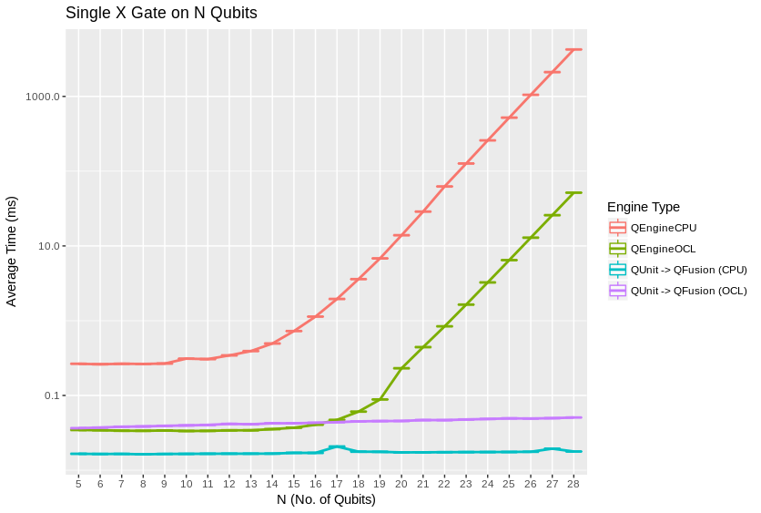
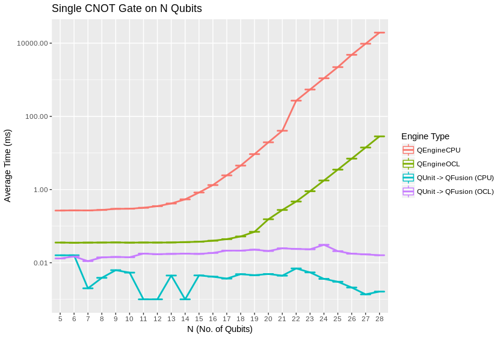
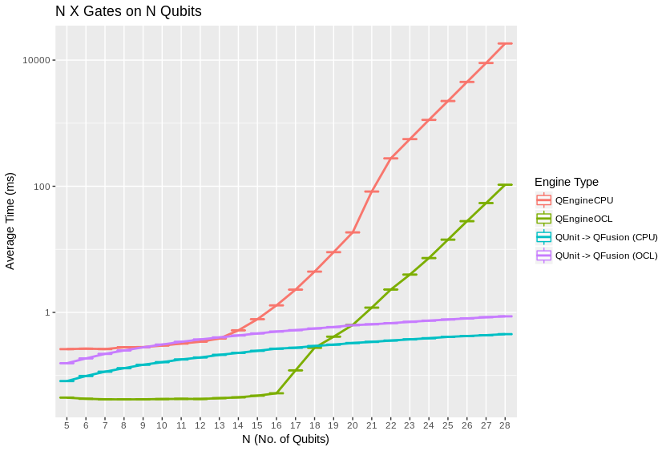
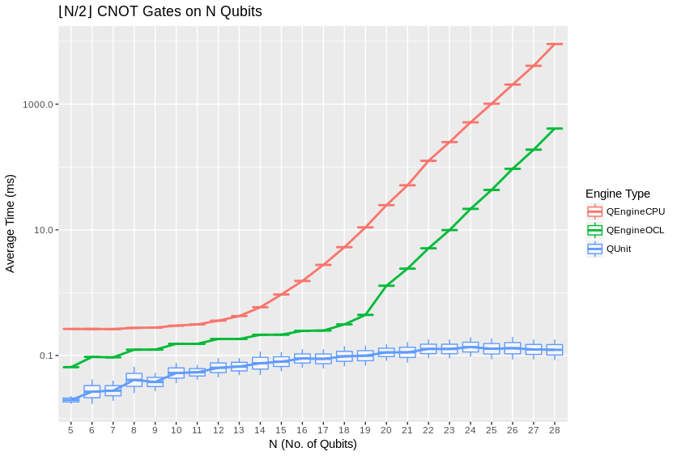
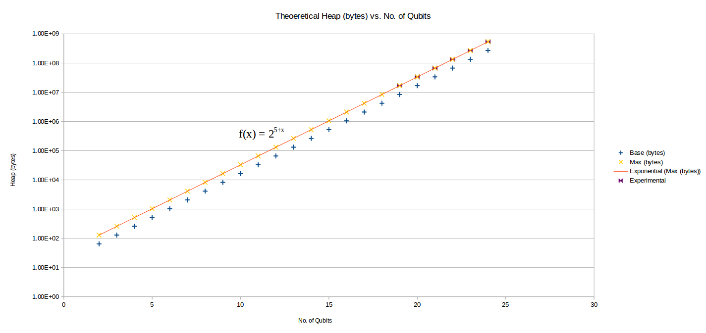
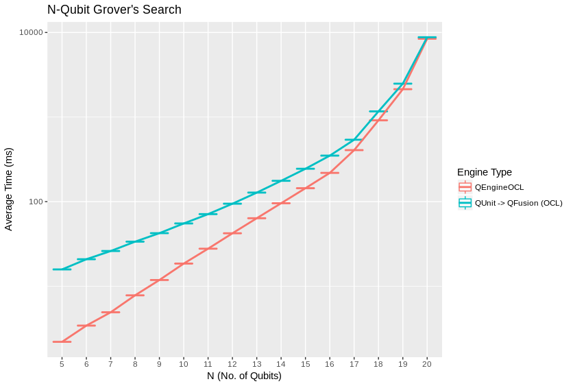

#################
Qrack Performance
#################

Abstract
********

The Qrack quantum simulator is an open-source C++ high performance, general
purpose simulation supporting arbitrary numbers of entangled qubits.  While
there are a variety of other quantum simulators such as `Q#`_, `QHipster`_,
and others listed on `Quantiki`_, Qrack represents a unique offering suitable
for applications across the field.

A selection of performance tests are identified for creating comparisons
between various quantum simulators.  These metrics are implemented and
analyzed for Qrack.  These experimentally derived results compare favorably
against theoretical boundaries, and out-perform naive implementations for many
scenarios.

Introduction
************

There are a growing number of quantum simulators available for research and
industry use.  Many of them perform quite well for smaller number of qubits,
and are suitable for non-rigorous experimental explorations.  Fewer projects
are suitable for the growing mid-tier range of experimentation in the 20-30
qubit range.

Despite the availability of a selection of implementations, very little has
been established when comparing the performance between different simulators.
Broadly, the substantial bottlenecks around memory and IO utilization have
largely preempted analysis into CPU efficiencies and algorithmic
optimizations.  There are some exceptions, such as IBM's `Breaking the 49-Qubit Barrier in the Simulation of Quantum Circuits`_ paper.

Qrack provides high performance in the 20-30 qubit range, as well as an
open-source implementation in C++ suitable for utilization in a wide variety
of projects.  As such, it is an ideal test-bed for establishing a set of
benchmarks useful for comparing performance between various quantum
simulators.

Future publications will compare the performance of Qrack against other
publicly available simulators, as rigorous implementations can be implemented.

Reader Guidance
===============

This document is largely targeted towards readers looking for a quantum
simulator that desire to establish the expected bounds for various use-cases
prior to implementation.

Disclaimers
===========

* Your Mileage May Vary - Any performance metrics here are the result of
  experiments executed on local machines; execute the supplied benchmarks on
  the desired target system for accurate performance assessments.

* Benchmarking is Hard - While we've attempted to perform clean and accurate
  results, bugs and mistakes do occur.  If flaws in process are identified,
  please let us know!

Method
******

100 timed trials of each method were run for each qubit count between 3 and 24 qubits. The average and quartile boundary values of each set of 100 were recorded and graphed. Grover's search to invert a black box subroutine, or "oracle," was similarly implemented for trials between 3 and 17 qubits. Grover's algorithm was iterated an optimal number of times, vs. qubit count, to maximize probability on a half cycle of the algorithm's period, being :math:`floor(π/{4*asin[sqrt(2^N)]})` iterations.

The test machine has an 04WT2G Alienware motherboard with Alienware BIOS A15. Its CPU is an Intel(R) Core(TM) i7-4910MQ. Its GPU is an NVIDIA Corporation GM204M [GeForce GTX 970M]. Its operating system is Ubuntu 16.04.4 LTS. It has 24GB of 1600MHz DDR3 RAM in 8GBx2 and 4GBx2 SODIMM configuration.

Heap profiling was carried out with Valgrind Massif. Heap sampling was limited but ultimately sufficient to show statistical confidence.

Results
*******

We observed extremely close correspondence with theoretical complexity and RAM usage considerations for the behavior of all engine types. QEngineCPU and QEngineOCL require exponential time for a single time over N qubits. QUnit types with explicitly separated subsystems as per https://arxiv.org/abs/1710.05867 show constant time requirements for the same single gate.

QEngineCPU and QEngineOCL can perform many identical gates in parallel across entangled subsystems for about the same cost as a single gate. To test this, we can apply parallel gates at once across the full width of a coherent array of qubits. (CNOT is a two bit gate, so (N-1)/2 gates are applied to odd numbers of qubits.) Notice in these next graphs how QEngineCPU and QEngineOCL have approximately the same scaling cost as the single gate graphs above, while QUnit types show a linear trend (appearing logarithmic on an exponential axis scale):

Heap sampling showed high confidence adherence to theoretical expecations. Complex numbers are represented as 2 double (64-bit) accuracy floating point types, for real and imaginary components. There is one complex number per permutation in a separable subsystem of qubits. QUnit explicitly separates subsystems, while QEngine maintains complex amplitudes for all 2^N permutations of N qubits. QEngines duplicate their state vectors once for speed and simplicity where it eases implementation.

Grover's algorithm is a relatively ideal test case, in that it allows a minimum of abstraction in implementation while representing an ostensibly practical and common task for truly quantum computational hardware. For 1 expected correct function inversion result, there is a well-defined highest likelihood search iteration count on half a period of the algorithm for a given number of oracle input permutations to search. This graphs shows average time against qubit count for an optimal half period search:

A representative sample of Qrack methods were run for 100 trials per qubit as above, for parallel gates up to the full span of the qubits. Multiple bit gates spanned the full length of coherent qubits up to integer division flooring for 2 and 3 qubit gates. Taking an observed threshold of 10 to 15 qubits for API method overhead to become much larger than "noise" levels, we regressed the high qubit end of each graph for an exponential fit for time against qubits. These regression equations are presented in tables of representative samplings of the API. The results follow this equation:

.. math::
   :label: regression_eq

   [Milliseconds] = \exp \left( [Base] \left( [No. of Qubits] + [Intercept] \right) \right)

In addition to the base and intercept, the table also notes the "First Qubit" that passed the noise threshold for the high qubit end of the graph, on the basis of its R^2 statistic being just greater than or equal to 0.99. The R^2 and model p-value are also reported. Assuming a "noise" threshold, note that these equations are expected to be biased in the direction of underestimating the exponential "Base" of the relationship. "Intercept" is then an estimate of how many qubits it would take for the method to 1 millisecond on average.

The quantum Fourier transform ("QFT") is consistently the slowest register-like operation. This offers a reasonable control case, as QFT is one of the only register-like API methods implemented in terms of calls to other fundamental gate methods.

Software
========

These are a representative sample of regression equations for QEngineCPU. Testing was carried out on parallel gates across the full width of a coherent unit of quantum memory, up to integer flooring on 2 and 3 qubit gates.

.. csv-table:: Regressed QEngineCPU Speed Equations
  :header: "Method","First Qubit","Base","Intercept","R^2","p-value"
  :widths: auto
  
  "INC",12,0.815,-18.97,0.996,8.7E-15
  "X",16,0.933,-16.2,0.991,1.88E-08
  "ROL",15,0.856,-15.67,0.993,6.02E-10
  "PhaseFlip",13,0.646,-15.47,0.993,3.13E-12
  "M",12,0.62,-15.2,0.993,4.56E-13
  "INCS",12,0.666,-15.14,0.991,1.12E-12
  "LDA",13,0.632,-14.92,0.992,7.39E-12
  "Swap",13,0.728,-14.91,0.992,7.78E-12
  "LSL",14,0.774,-14.63,0.99,2.17E-10
  "CNOT",12,0.677,-14.46,0.995,4.13E-14
  "INCSC",12,0.629,-14.34,0.992,6.75E-13
  "INCC",12,0.627,-14.32,0.992,5.44E-13
  "AND",13,0.672,-13.98,0.992,6.76E-12
  "ADC",12,0.627,-13.94,0.995,8.37E-14
  "ASL",14,0.725,-13.81,0.991,1.46E-10
  "CLOR",14,0.725,-13.81,0.991,1.46E-10
  "CLXOR",14,0.725,-13.81,0.991,1.46E-10
  "XOR",13,0.697,-13.47,0.992,7.01E-12
  "CRT",14,0.709,-13.27,0.991,1.7E-10
  "SBC",12,0.619,-13.26,0.991,1.07E-12
  "CY",13,0.681,-12.92,0.99,2.75E-11
  "OR",13,0.699,-12.44,0.992,9.37E-12
  "CLAND",12,0.681,-11.4,0.993,2.41E-13
  "Y",12,0.678,-10.9,0.992,6.35E-13
  "RT",10,0.683,-9.65,0.994,1.17E-15
  "QFT",11,0.682,-7.98,0.99,2.18E-13

OpenCL
======

These are a representative sample of regression equations for QEngineOCL. Testing was carried out on parallel gates across the full width of a coherent unit of quantum memory, up to integer flooring on 2 and 3 qubit gates.

.. csv-table:: Regressed OpenCL Speed Equations
  :header: "Method","First Qubit","Base","Intercept","R^2","p-value"
  :widths: auto

  "PhaseFlip",13,0.645,-15.6,0.99,1.96E-11
  "X",14,0.642,-15.55,0.992,7.46E-11
  "ROL",14,0.641,-15.53,0.992,7.35E-11
  "INC",14,0.642,-15.52,0.993,4.65E-11
  "INCS",14,0.642,-15.52,0.992,1.17E-10
  "Swap",14,0.643,-15.52,0.993,6.23E-11
  "M",12,0.603,-14.82,0.997,2.07E-15
  "LDA",15,0.624,-14.24,0.994,3.49E-10
  "INCSC",15,0.645,-14.22,0.997,3.76E-11
  "INCC",13,0.598,-13.97,0.991,1.71E-11
  "LSL",13,0.606,-13.94,0.991,1.42E-11
  "CLXOR",10,0.617,-13.86,0.99,2.05E-14
  "CNOT",14,0.639,-13.77,0.994,2.8E-11
  "ADC",14,0.592,-13.74,0.99,2.88E-10
  "AND",14,0.655,-13.65,0.99,2.42E-10
  "SBC",14,0.614,-13.52,0.99,2.15E-10
  "CY",11,0.678,-13.39,0.994,1.26E-14
  "CRT",11,0.678,-13.38,0.994,1.25E-14
  "CLOR",12,0.624,-13.36,0.993,3.6E-13
  "ASL",13,0.595,-13.06,0.992,8.57E-12
  "XOR",14,0.65,-12.72,0.991,1.7E-10
  "OR",13,0.669,-12.43,0.991,1.78E-11
  "Y",10,0.68,-11.66,0.994,8.93E-16
  "RT",11,0.685,-11.47,0.995,3.71E-15
  "CLAND",11,0.662,-11.15,0.991,1.14E-13
  "QFT",10,0.704,-9.18,0.991,7.8E-15

Discussion
**********

Up to a consistent deviation at low qubit counts, speed and RAM usage is well predicted by theoretical complexity considerations of the gates, up to a factor of 2 on heap usage for duplication of the state vector.

We might speculate that, at high qubit counts, the calculations operate almost entirely on heap, while system call and cache hit efficiency consistently alter the trend up until around roughly 12 qubits, on the test machine, causing the apparent inflection points observed in the graphs given above. For "software" simulation, this would be roughly consistent with the advertised 8MB cache of the i7-4910MQ. If the reduction in the slope of the trend to this point is primarily due to cache hit, about 8 fully entangled qubits would be ideal for an 8MB cache.

Further Work
************

We suggest that a good next primary target for optimizing Qrack is to allow cluster distribution of all the various engine types. Also, CPU "software" implementation parallelism relies on certain potentially expensive standard library functionality, like lambda expressions, and might still be micro-optimized. The API offers many optimized bitwise parallel operations over contiguous bit strings, but similar methods for discontiguous bit sets should be feasible with bit masks, if there is a reasonable demand for them. Further, there is still opportunity for better constant bitwise parallelism cost coverage and better explicit qubit subsystem separation in QUnit.

We will also develop and maintain systematic comparisons to published benchmarks of quantum computer simulation standard libraries, as they arise.

Conclusion
**********

Per `arXiv:1710.05867`_, explicitly separated subsystems of qubits in QUnit have a significant RAM and speed edge in many cases over the "Schrödinger algorithm" of QEngineCPU and QEngineOCL. One of Qrack's greatest new optimizations to either general algorithm is constant complexity or "free" scaling of bitwise parallelism in entangled subsystems, compared to linear complexity scaling without this optimization. Qrack gives at least reasonably efficient performance on a single node up to approximately 30 qubits, in the limit of maximal entanglement.

Citations
*********

.. target-notes::

.. _`Q#`: http://TBD.com
.. _`QHipster`: https://TBD.com
.. _`Quantiki`: https://www.quantiki.org/wiki/list-qc-simulators
.. _`Breaking the 49-Qubit Barrier in the Simulation of Quantum Circuits`: https://arxiv.org/abs/1710.05867
